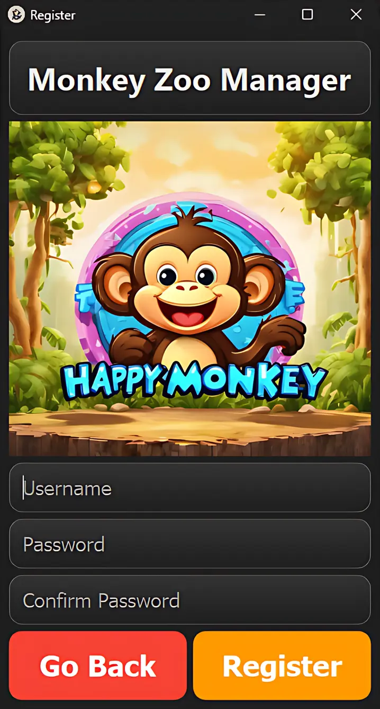
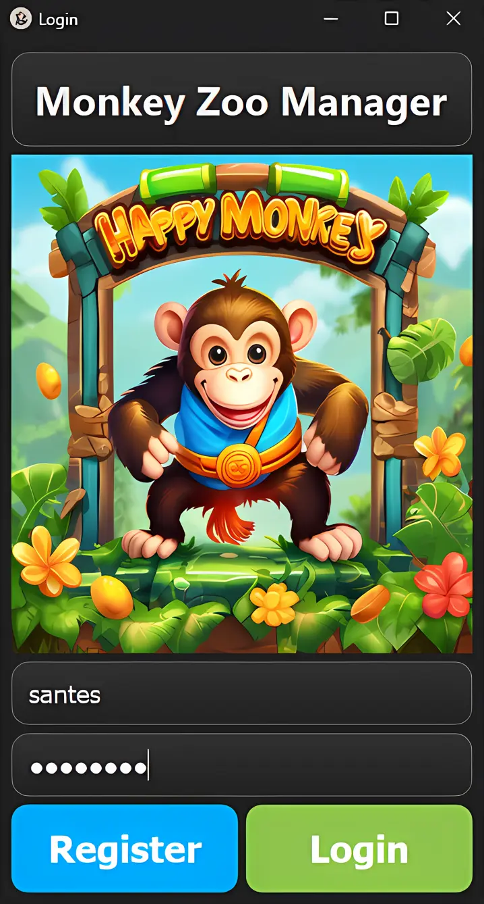
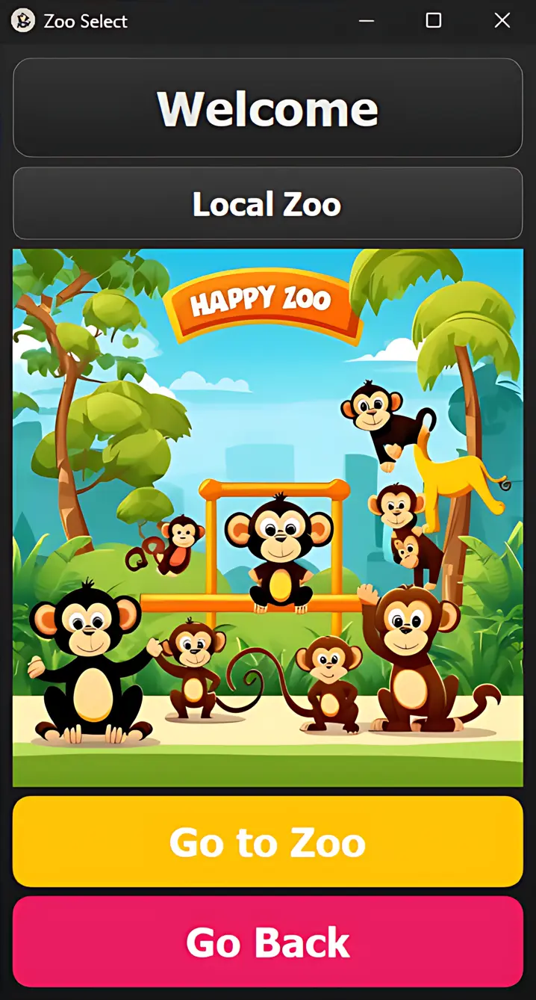
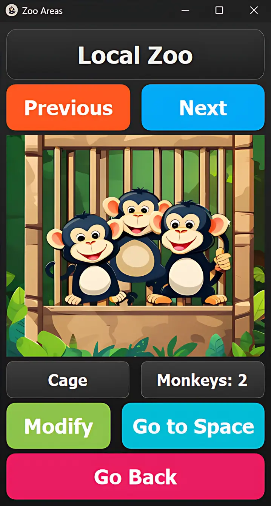
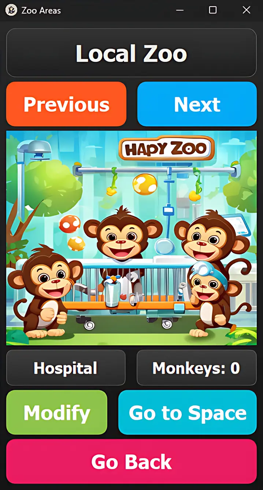
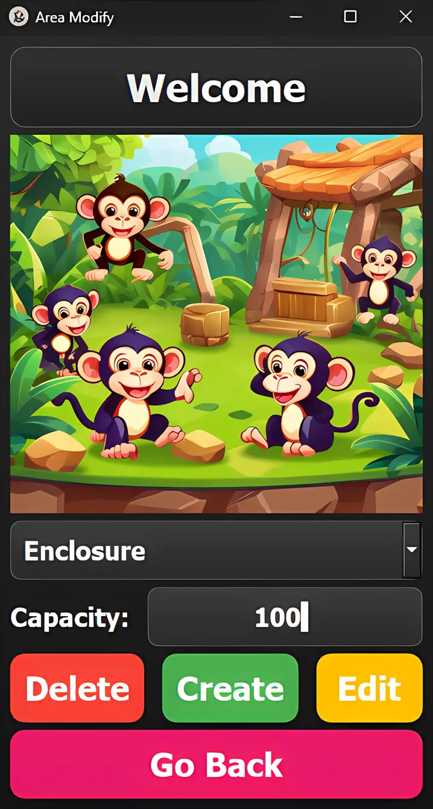
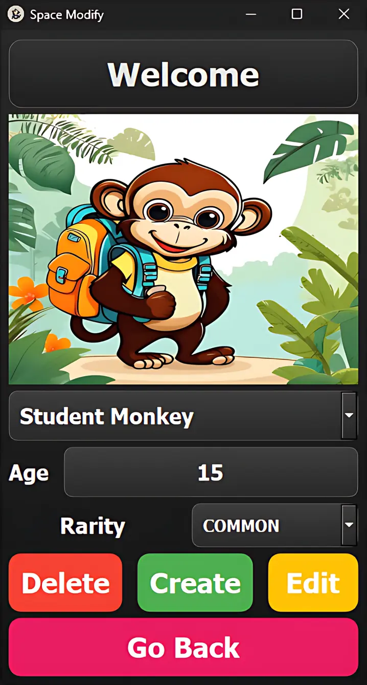
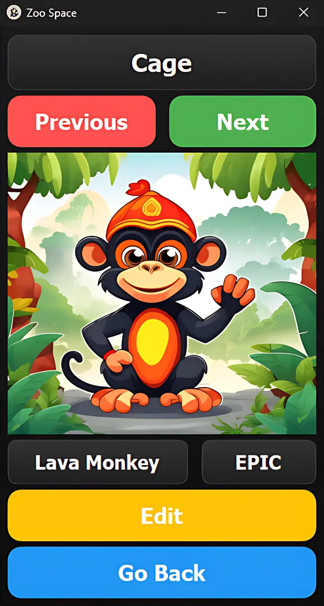
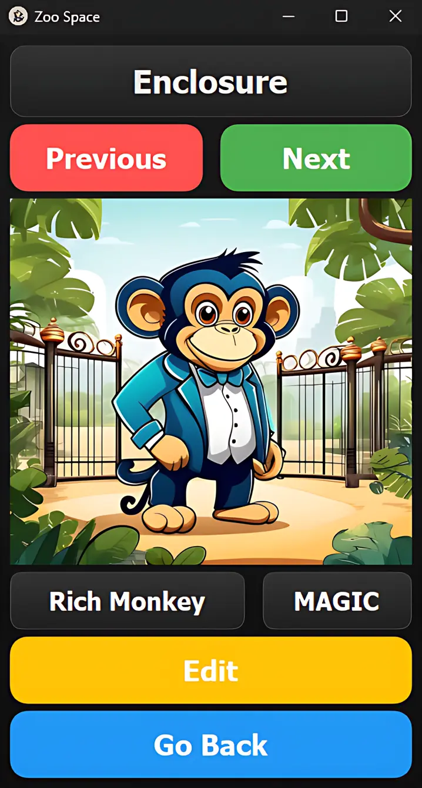
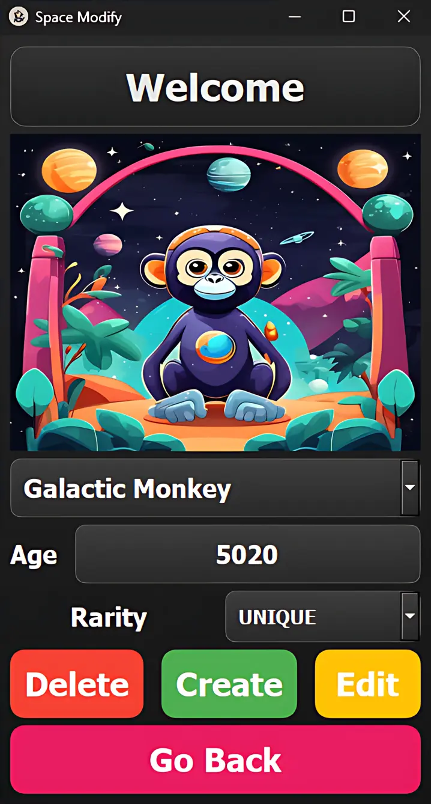

# 🐵 Monkey Zoo Manager App 🐵

College Project for managing zoo monkeys with a register/login system, habitats/monkeys view.

## ✨ Current Features (25.07.2024) ✨

### 🔐 Log In Features:

- **Register** – Users can register an account.
- **Login** – Registered users can log in using their username and password.

### 🌳 Zoo Features:

- **Zoo, habitat, and monkey viewing**
- **Managing monkeys in their natural habitats**
- **Viewing monkey stats**
- **Adding/removing/modifying monkeys**
- **Adding/removing/modifying habitats**

The entire project is prepared and can be easily set up. The provided screenshots demonstrate its functionality.

If you need additional details or a different focus, please let me know!

## 📸 Screenshots:

<table>
  <tr>
    <td align="center">
      <b>🏠 Register View:</b> 
      
    </td>
    <td align="center">
      <b>🔑 Log In View:</b> 
      
    </td>
  </tr>
  <tr>
    <td align="center">
      <b>🦍 Zoo Select View:</b> 
      
    </td>
    <td align="center">
      <b>🏗️ Cage View:</b> 
      
    </td>
  </tr>
  <tr>
    <td align="center">
      <b>🏥 Hospital View:</b> 
      
    </td>
    <td align="center">
      <b>🛠️ Area Edit View:</b> 
      
    </td>
  </tr>
  <tr>
    <td align="center">
      <b>📚 Student Monkey View:</b> 
      
    </td>
    <td align="center">
      <b>🌋 Lava Monkey View:</b> 
      
    </td>
  </tr>
  <tr>
    <td align="center">
      <b>💰 Rich Monkey View:</b> 
      
    </td>
    <td align="center">
      <b>🚀 Space Create View:</b> 
      
    </td>
  </tr>
</table>

## 🛠️ Project Configuration

Just download the repo and open it with Visual Studio 2022. QT 6.7.2 needs to be installed in order to build and run the project.

Enjoy managing your monkeys with ease and clarity! 🚀
